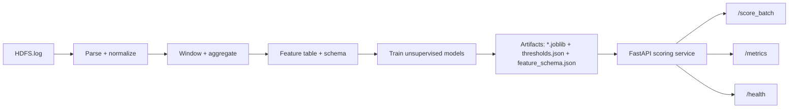

# Flagship 2: Log Anomaly Detection (HDFS)

End-to-end log anomaly detection on HDFS system logs:
- Build structured, window-level features from raw logs
- Train unsupervised anomaly models
- Serve batch scoring via an API with lightweight monitoring and CI smoke tests

---

## Problem

Distributed systems produce massive logs. When systems degrade, logs often show:
- rare or novel event patterns
- shifts in frequency of known events
- bursts, drops, or abnormal mixes by subsystem

Goal: **score log-derived windows** and flag suspicious windows as anomalies, so an engineer can triage faster.

---

## Dataset

This project is designed around **HDFS_v1** from **Loghub** (LogPai). The dataset is generated using benchmark workloads and manually labeled using handcrafted rules. It is sliced into traces by `block_id`, and each trace gets a ground-truth label (normal/anomaly). :contentReference[oaicite:0]{index=0}

Download source: the raw logs are available via Loghub. :contentReference[oaicite:1]{index=1}

Expected local path (default convention):
- `data/raw/hdfs/HDFS.log`

> Notes:
> - If you use the dataset in research, please cite Loghub and the referenced HDFS papers. :contentReference[oaicite:2]{index=2}

---

## Approach

### Feature pipeline (high level)
1. **Parse raw log lines** into structured fields (timestamp, component, message, etc.)
2. **Normalize messages into templates** (reduce variable tokens to a stable event type)
3. **Aggregate into fixed windows** (windowed event counts and summary stats)
4. Produce a fixed feature table aligned to a saved schema (`artifacts/feature_schema.json`)

### Models
The scoring service supports two unsupervised models:
- `iforest` (Isolation Forest)
- `ocsvm` (One-Class SVM)

At API startup, the service loads these artifacts from `artifacts/`:
- `iforest.joblib`
- `ocsvm.joblib`
- `thresholds.json`
- `feature_schema.json`

If artifacts are missing, the API will fail fast at startup (intentional, avoids “half working” service).

---

## Architecture



---

## Results

This project is intentionally unsupervised, so “results” are measured operationally:

- Service starts reliably (artifacts + schema load)
- Batch scoring works end-to-end (`/score_batch`)
- Monitoring endpoints report health and score distribution (`/metrics`)
- CI smoke tests prevent regressions

If you want to add classical metrics later, you can evaluate against the HDFS_v1 anomaly labels and report:

- Precision / recall / F1
- Alert volume vs. threshold percentile
- Latency distribution vs. batch size

---

## Tradeoffs

Unsupervised detection is practical when labels are scarce, but thresholds require tuning.

Fixed schemas are great for reliable serving, but require careful versioning if the feature pipeline changes.

Template-based features reduce dimensionality, but can miss anomalies that are mostly in parameters (not template type).

---

## Failure Modes

Common ways log anomaly pipelines break:

- Parsing drift: log format changes or unexpected lines degrade feature quality.
- Template collisions: two distinct events collapse into one template.
- Concept drift: system behavior changes after deploys, causing false positives until retraining.
- Schema mismatch: serving expects a fixed feature schema, pipeline changes must regenerate artifacts.

---

## Reliability Polish: Strict Input Validation

`POST /score_batch` performs strict validation against `artifacts/feature_schema.json`:

- Rejects missing feature keys
- Rejects extra feature keys
- Rejects non-numeric and non-finite values

This prevents silently scoring malformed payloads.

---

## Run Locally

### Install

Use your existing environment setup for the repo (conda or venv). Typical flow:

```bash
python -m pip install -r requirements.txt
```

### Ensure Artifacts Exist

You need the artifacts folder before starting the API.

If you have a build script in this repo:

```bash
python scripts/build_service_artifacts.py
```

(If your workflow generates artifacts another way, do that instead. The API only cares that artifacts/ contains the expected files.)

### Start the API

From repo root:

```bash
uvicorn api:app --app-dir src --host 127.0.0.1 --port 8000
```

### Health + Metrics

```bash
curl -s http://127.0.0.1:8000/health | python -m json.tool
curl -s http://127.0.0.1:8000/metrics | python -m json.tool
```

---

## API Usage

### `POST /score_batch`

Because schema validation is strict, the easiest way to build a valid payload is to read
artifacts/feature_schema.json and construct a complete feature dict.

Example (Python one-liner style):

```bash
python - <<'PY'
import json, requests
cols = json.load(open("artifacts/feature_schema.json","r"))["feature_columns"]
features = {c: 0.0 for c in cols}

payload = {
  "model": "iforest",
  "rows": [
    {"group":"blk_demo_1","window_start":"2000-01-01T00:00:00Z","features":features},
    {"group":"blk_demo_2","window_start":"2000-01-01T00:05:00Z","features":features},
  ]
}

r = requests.post("http://127.0.0.1:8000/score_batch", json=payload, timeout=10)
print(r.status_code)
print(r.text[:500])
PY
```

The response includes per-row:

- `anomaly_score`
- `is_anomaly` (thresholded)

---

## CI and Smoke Tests

This repo is set up to run:

- Unit tests via `pytest`
- API smoke test in CI (starts the API, calls `/health` and `/score_batch`)

Local smoke test:

```bash
python scripts/smoke_test_api.py
```

Tip: In CI, artifacts may be generated dynamically (tiny dummy artifacts) so the API can start even without the full dataset.

---

## License

Add a license if you plan to share broadly (MIT is a common default).
